# MjengoOS — Build with evidence 🇰🇪

An **evidence-based construction project OS for Kenya**: phase budgets on a
double-entry ledger, escrow-backed milestones released against photo proof,
**MjengoScore** (an evidence-derived contractor trust score), hash-stamped
**evidence draw packs** for diaspora clients, AI photo verification, `*384#`
USSD and WhatsApp attendance for feature phones, and share links that let
clients abroad watch their build without an account.

[](https://nextjs.org)
[](https://www.typescriptlang.org)
[](https://tailwindcss.com)
[](https://www.prisma.io)
[](https://bun.sh)
[](https://vitest.dev)
[](./LICENSE)

**Philosophy:** *don't just record what people say happened — record the
evidence around what happened.* Reported vs verified, everywhere. The ledger
never lies; AI never approves; payments are idempotent; closing stock is
always derived.

## Contents

- [The product in one page](#the-product-in-one-page) · [Visual tour](#visual-tour)
- [Demo accounts (seed data)](#demo-accounts-seed-data) · [Feature tour (the real tabs)](#feature-tour-the-real-tabs)
- [Architecture](#architecture)
- [Tech stack](#tech-stack) · [Quick start](#quick-start)
- [Environment variables](#environment-variables) · [Security engineering](#security-engineering)
- [i18n — English + Kiswahili](#i18n--english--kiswahili) · [Deployment](#deployment)
- [CI/CD](#cicd) · [Honesty notes (deliberate)](#honesty-notes-deliberate)
- [Project structure & docs](#project-structure--docs) · [License](#license)

## The product in one page

| | |
|---|---|
| **Marketing site** (`/website`) | The public pitch: what MjengoOS is, who it's for, pricing, security. |
| **Web app** (`:3000`) | The product: login gate → role-aware workspace with 13 tabs, offline outbox, PWA. |
| **Mobile shell** | Same app, phone-first: bottom nav (≤5 tabs + More sheet + camera quick-action). |
| **Client share links** | `/?share=<token>` — diaspora clients approve milestones, comment on photos, decide invoices. No account. The token is the auth. |

### Visual tour

**The marketing website** (`/website`, served by the web app's origin — one
URL for the whole product):

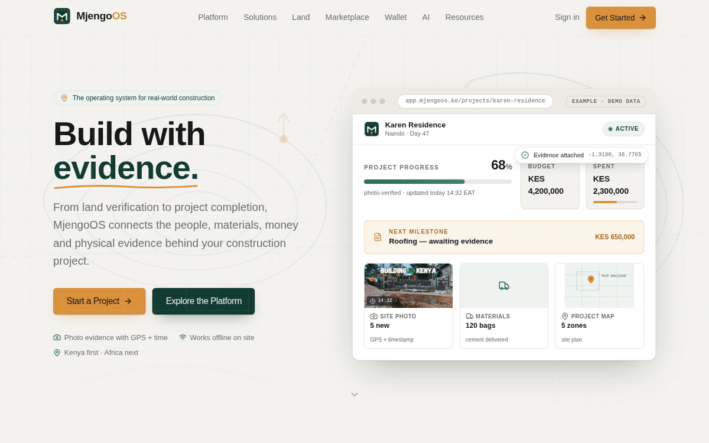

**Sign-in gate** — every demo role is one tap away:

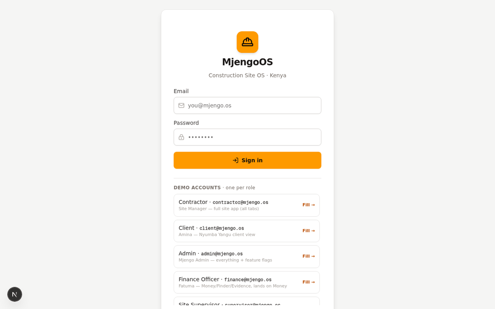

**Overview** — Day 47 · 37% complete · KSh 727K / KSh 4.5M budget burn-down,
Project Health, alerts, daily recap, report exports:

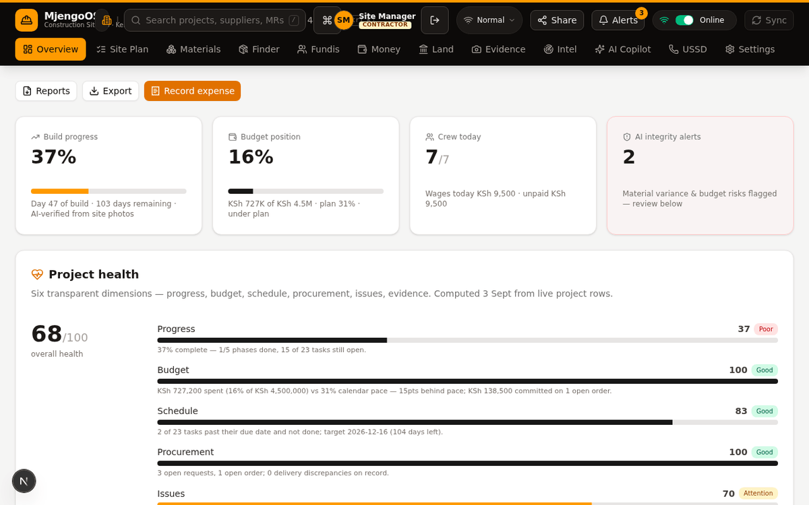

**Money** — MjengoPay escrow on a double-entry ledger: KSh 1.2M in escrow,
milestones with proof-of-work gates, variation orders, payment requests,
balanced ledger view:

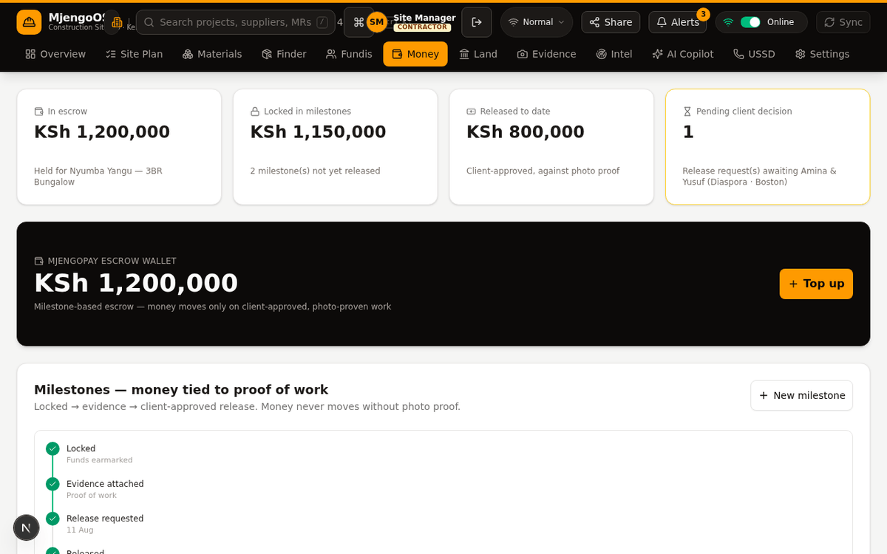

**Money → evidence draw pack** — the proof freezes the moment money moves: an
immutable, SHA-256-stamped bundle of the evidence photos, ledger reference,
open variations, attendance window and the MjengoScore at release — printable
and forwardable through the client's share link:

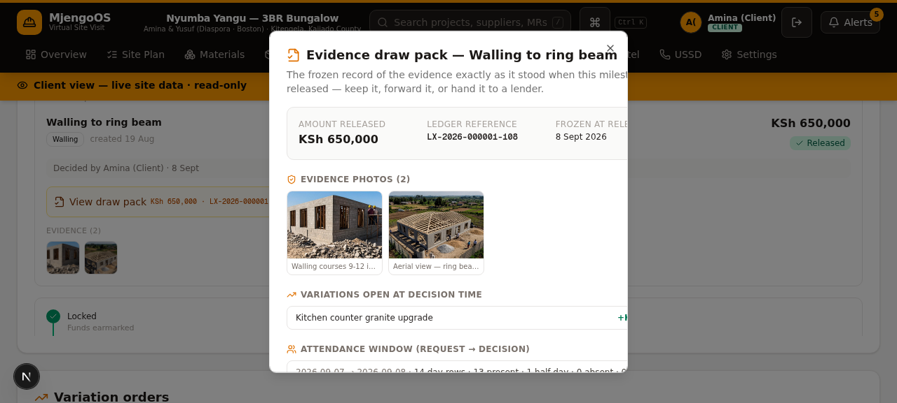

**Materials** — Site Store append-only stock ledger with derived closing
stock, delivery log, consumption:

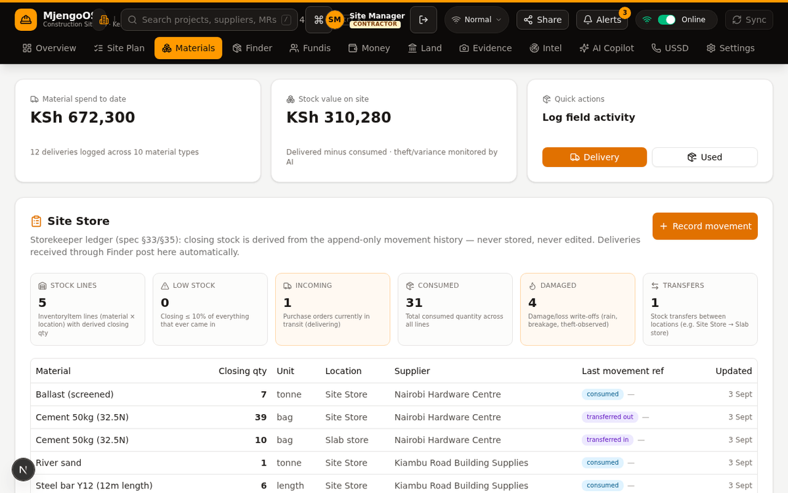

**Evidence** — the Bias-Free Ledger: append-only audit of every action with
actor, IP, user-agent and request id:

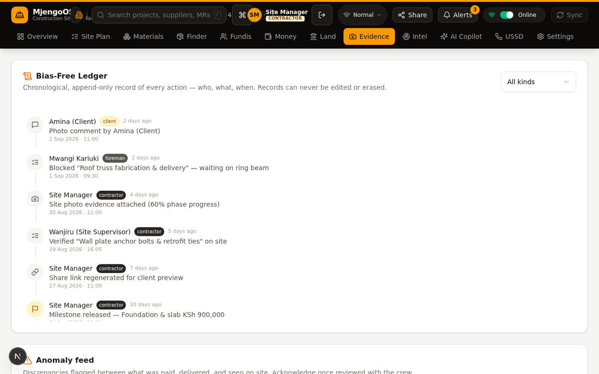

**Intel → MjengoScore** — a deterministic 0–100 contractor trust score
computed from the project's evidence rows (releases, attendance, budget
pace, variations, deliveries, invoices) with per-component deductions and
an honest "describes, humans decide" label:

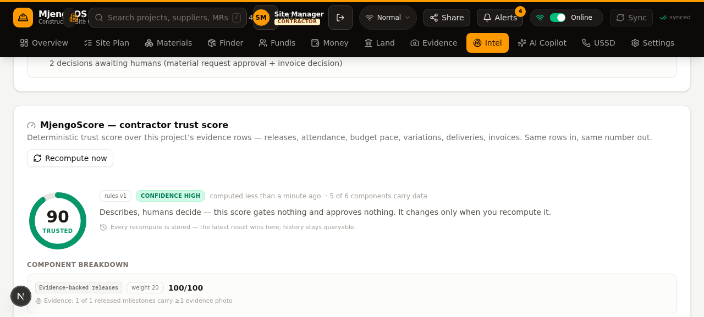

**Phone-first** (`src/mobile` bottom nav) and the ⌘K command palette:

<p>
  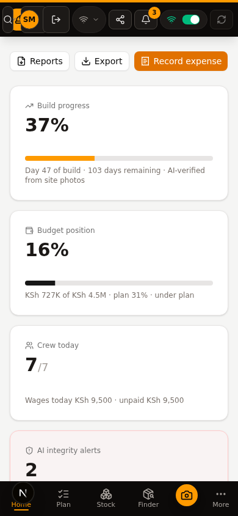
  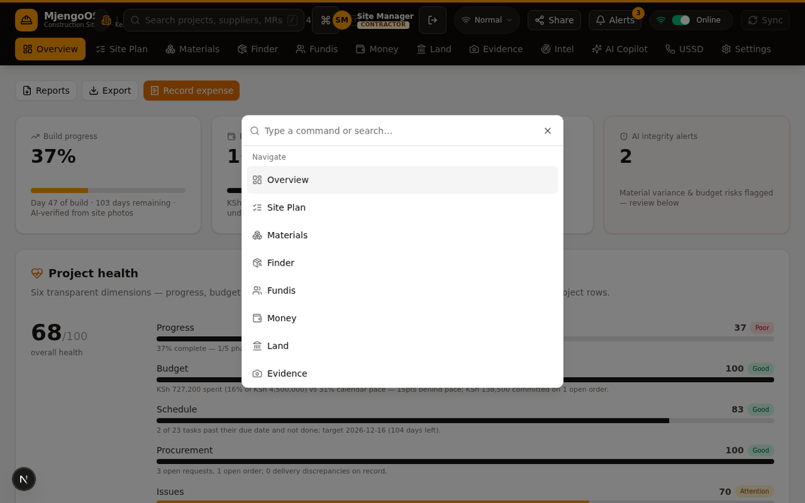
</p>

## Demo accounts (seed data)

Seeded by `prisma/seed-extras/users.ts` so the full role matrix is explorable
immediately. **These are intentional demo seeds, not real credentials.**

| Email | Password | Role | Landing tab |
|---|---|---|---|
| `contractor@mjengo.os` | `mjengo2026` | Contractor — full owner app | Overview |
| `client@mjengo.os` | `mjengo2026` | Client — read-only "Virtual Site Visit" + decisions | Overview |
| `admin@mjengo.os` | `admin2026` | Admin — owner app + feature flags + Audit tab | Overview |
| `finance@mjengo.os` | `mjengo2026` | Finance — payment approvals, wallet ops, `/api/v1` | Money |
| `supervisor@mjengo.os` | `mjengo2026` | Site Supervisor — site operations + evidence | Overview |
| `procurement@mjengo.os` | `mjengo2026` | Procurement — closed-loop supply chain | Finder |
| `qs@mjengo.os` | `mjengo2026` | Quantity Surveyor — BOQ, materials, costs | Materials |

A **supplier** demo account ships with the Wave-5 supplier portal (in
flight — see the shipping row in the feature tour).

Diaspora clients with a **share link** need no account at all. Owner APIs are
guarded server-side (401/403); client roles and share tokens can only run an
explicit allowlist of actions (`src/shared/client-actions.ts` — approve
milestones/variations/payment requests, decide client-band material requests,
pay invoices, comment on photos, read notifications).

## Feature tour (the real tabs)

| Tab | What a user gets |
|---|---|
| **Overview** | KPIs, budget burn-down vs plan, **Project Health** (6 transparent dimensions with a "how this is computed" breakdown), digital-twin time-lapse, interactive site map, alerts, daily recap, **report exports** (Daily/Weekly/Financial/Procurement CSV + Weekly PDF), photo evidence with comment threads |
| **Site Plan** | Phases → tasks, progress sliders, task priorities/assignees/blockers |
| **Materials** | Inventory, delivery log (voice or manual), consumption, **Site Store** — append-only stock-movement ledger (opening/received/consumed/transferred/returned/damaged/adjusted) with derived closing stock + CSV export |
| **Finder** | Procurement closed loop: BOQ → approval-rules engine (role bands, auto-approve within limit, chained client+finance over 250K) → RFQ + multi-line quotes → landed-cost comparison → PO lifecycle → **delivery verification** (per-line counts, damage, GPS, photos — ordered 50 / received 48 = discrepancy) → auto-posted Site Store movements → supplier invoices w/ client decision queue → **3-way match** (PO ↔ invoice ↔ delivery) → payments. Supplier directory + saved shortlists + price-history chips |
| **Fundis** | **Workforce Trust**: verified vs reported vs exception attendance levels, daily muster roll, payroll gated on verification, kiosk PINs, check-in via app/USSD/kiosk QR, CSV export |
| **Money** | **MjengoPay escrow on a double-entry ledger** (simulated money, real workflow): top-ups post balanced entries, milestone releases gated on photo proof, variation orders, payment requests with chained approval, reversals (history is never edited), cost codes, `PaymentProvider` seam (Daraja sandbox when configured), **evidence draw packs** — immutable, hash-stamped proof bundles frozen at every milestone release, served (and printable) through the revocable client share link |
| **Land** | Parcels + title-deed transcriptions, registry-search requests with deterministic consistency check, review gate, parcel timelines, printable **Property Passport**, professionals directory with verification ladder — honest: searches are recorded, not registry-confirmed |
| **Evidence** | **Bias-Free Ledger** — append-only audit of every action with actor, IP, user-agent, request id and entity context; filters, anomaly feed, PDF reports |
| **Intel** | Deterministic risk rules (weighted 5-rule score), **MjengoScore** — the contractor trust score derived from evidence rows (six traceable components, append-only history, gates nothing), weekly digest, regional price trends, supplier reliability from actual transactions, **background jobs** (anomaly scan, digest, reconciliation, overdue check) |
| **AI Copilot** | Vision photo analysis (phase, PPE, material counts) with a working upload pipeline, Swahili voice-to-invoice, anomaly scan — behind the `ai_progress` feature flag |
| **Field channels — USSD + WhatsApp** | `*384#` muster-line simulation (menu → PIN → present/absent) dispatching real attendance records, plus the **WhatsApp field line**: workers text `PRESENT` / `ABSENT` / `HALF` / `BALANCE` or free text — the webhook contract is documented (`GET /api/whatsapp`), replies are footered "MjengoOS sim", and attendance + photo notes land through the same domain appliers the app uses (no Meta Cloud API wired — an honest seam) |
| **Audit** | Admin-only drill-down into the full audit trail (contractors and clients don't see it) |
| **Settings** | Profile, language (English/Kiswahili), local preferences, notification prefs — per-user, every role |
| **Supplier portal** | *Shipping (Wave 5, in flight)* — a scoped surface for the marketplace's supply side: catalog, quotes, orders, delivery confirmation. Not in this build yet — the marketplace today is owner-side only, by honest design. |

**Role matrix** (mirrors `src/shared/permissions.ts` ↔ `src/backend/lib/guard.ts`):

| Tab | Contractor | Admin | Supervisor | Finance | Procurement | QS | Client |
|---|:--:|:--:|:--:|:--:|:--:|:--:|:--:|
| Overview | ✅ | ✅ | ✅ | ✅ | ✅ | ✅ | ✅ |
| Site Plan | ✅ | ✅ | ✅ | — | — | ✅ | ✅ |
| Materials | ✅ | ✅ | ✅ | — | ✅ | ✅ | ✅ |
| Finder | ✅ | ✅ | ✅ | ✅ | ✅ | ✅ | ✅ |
| Fundis | ✅ | ✅ | ✅ | — | — | — | ✅ |
| Money | ✅ | ✅ | — | ✅ | — | — | ✅ |
| Land | ✅ | ✅ | — | — | — | — | ✅ |
| Evidence | ✅ | ✅ | ✅ | ✅ | ✅ | ✅ | ✅ |
| Intel | ✅ | ✅ | — | — | — | — | ✅ |
| AI Copilot | ✅ | ✅ | ✅ | — | — | — | — |
| USSD | ✅ | ✅ | ✅ | — | — | — | ✅ |
| Audit | — | ✅ | — | — | — | — | — |
| Settings | ✅ | ✅ | ✅ | ✅ | ✅ | ✅ | ✅ |

Unknown roles fail closed (one safe tab + an honest notice), client-side and
server-side, in the same commit.

**Also in the box:** multi-project workspace with global search (⌘K palette
navigates tabs, switches projects, runs quick actions), offline-first sync
(persisted outbox, server-side dedupe by outbox id — a lost HTTP response can
never double-post money), Data Saver photo downscaling, installable PWA
(`/api/*` is never cached — no stale money or evidence), notification center
with honest `deliveryStatus: logged` state, and a feature-flag system that
actually closes its feature when off — on `/api/actions`, per-item on the
offline `/api/sync` drain, and by allowlist on the share link.

## Architecture

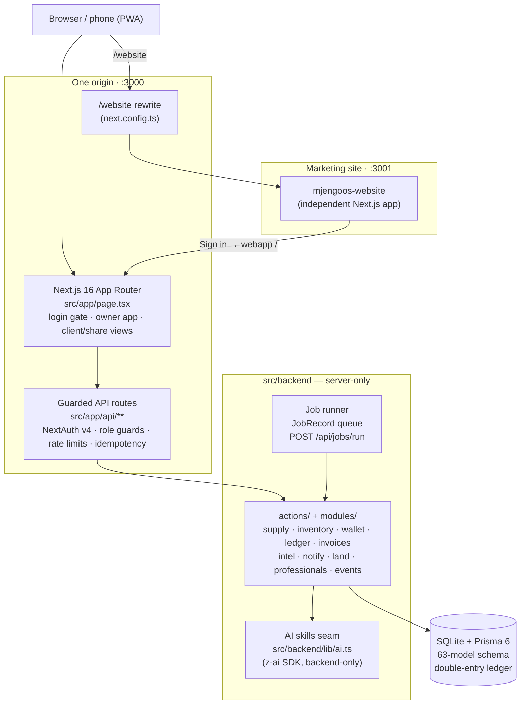

One Node process, one SQLite file, one uploads directory — no message queue,
no external services. The marketing site runs as a second Next.js app on
`:3001`, proxied through the web app at `/website` so a single origin serves
the whole product; its **Sign in** button lands on the webapp login screen.

### Source layout

```
src/
  app/          # Next.js App Router — page + /api/** routes (framework-fixed)
  frontend/     # web UI: mjengo/ (tabs), ui/ (shadcn), auth/, i18n/ (en+sw), hooks/
  backend/      # SERVER-ONLY: lib/ (guard, auth, audit, rate-limit, ai) +
                #   actions/ + modules/ (one folder per domain)
  mobile/       # phone-first shell: bottom nav, ≤5 tabs + More sheet + camera
  shared/       # isomorphic contracts: permissions matrix, CLIENT_ACTIONS allowlist
mjengoos-website/  # marketing site (independent app, :3001, proxied at /website)
prisma/            # schema.prisma (63 models), migrations/, seed chain
```

### REST API — `/api/v1`

The typed integration surface, documented live as **OpenAPI 3.1** at
`/api/openapi.json` (21 documented paths): **19 `/api/v1` paths** — wallets
(7 routes incl. deposit/transfer/withdraw with idempotency keys), payments,
projects (list/detail/tasks/deliveries), supply orders, **milestones**
(list/detail with the full release ladder), **invoices** (list/detail with
the **3-way-match verdict**: PO ↔ invoice ↔ delivery) and **escrow**
(ledger-derived — the balance is computed from double-entry ledger entries,
never a stored projection) — plus two app-level GETs (`/api/audit`,
`/api/reports/budget-variance`). One error shape (`{ error, field? }`), zod
strictObject validation, keyset pagination, per-principal rate limits and
scope pinning (a client session can only ever see its own project).

Full module boundaries and the production migration roadmap
(SQLite → PostgreSQL, monolith → services, `PaymentProvider` seams): see
[ARCHITECTURE.md](./ARCHITECTURE.md).

## Tech stack

| Layer | Choice |
|---|---|
| Framework | Next.js 16 (App Router, Turbopack, standalone output), React 19 |
| Language | TypeScript, `strict` — CI fails on any error |
| UI | Tailwind CSS 4, shadcn/ui + Radix primitives, lucide icons, cmdk palette |
| State | Zustand (app store + persisted offline outbox) |
| Auth | NextAuth v4 — credentials provider, JWT session cookies, scrypt hashes |
| Data | Prisma 6 + SQLite (63-model schema, SQL migrations, double-entry ledger) |
| Validation | Zod 4 on every mutating route |
| AI | z-ai-web-dev-sdk behind a backend-only seam (vision, voice, anomaly) |
| Runtime/tooling | Bun (install, seeds, dev), Node 20 for the production standalone server, Docker for self-host |

## Quick start

Prerequisites: [Bun](https://bun.sh) ≥ 1.1 (or Node 20+), openssl.

```bash
git clone https://github.com/Roy-Wanyoike/Mjengo-OS.git mjengo
cd mjengo
bun install

cp .env.example .env
#   DATABASE_URL=file:../db/custom.db      (repo-relative; db/ is gitignored)
#   NEXTAUTH_SECRET=$(openssl rand -hex 32)

bunx prisma generate
bunx prisma migrate deploy    # production path — or: bunx prisma db push
bun run dev                   # → http://localhost:3000
```

The database ships **empty** — seed the demo data. One command runs the
whole chain in dependency order (an `intel` re-run is folded in after
`money`, which wipes the notification kinds `intel.ts` owns):

```bash
bun run seed   # = seed.ts + users → tasks → domain → evidence → money
               #   → intel (re-run) → trust — fail-fast, with step notes
```

The individual steps, if you want partial re-seeds (each extras script
wipes only its own models — partial re-seeds are safe):

```bash
bun prisma/seed.ts                    # base: 3 demo projects, phases, tasks,
                                      #   workers, materials, photos + inline
                                      #   professionals → land → supply →
                                      #   invoices → intel
bun prisma/seed-extras/users.ts       # 7 demo login accounts (wipes ONLY User)
bun prisma/seed-extras/tasks.ts       # priorities, assignees, blockers
bun prisma/seed-extras/domain.ts      # worker depth, driver leg, team roster
bun prisma/seed-extras/evidence.ts    # zones, comments, notifications, audit
bun prisma/seed-extras/money.ts       # escrow, milestones, ledger, payment requests
bun prisma/seed-extras/trust.ts       # attendance trust history + PINs
```

Then sign in with a demo account above. Scripts: `bun run lint`,
`bunx tsc --noEmit`, `bun run db:push`, `bun run site:dev` (marketing site),
`bun run build` / `start` (standalone production server).

### Environment variables

| Variable | Value | Why |
|---|---|---|
| `DATABASE_URL` | required | SQLite file URL (`file:../db/custom.db` local, `file:/app/db/custom.db` in Docker) |
| `NEXTAUTH_SECRET` | required, stable | Signs/encrypts JWT session cookies. Rotating it signs everyone out. |
| `AUTH_TRUST_HOST` | `1` behind a proxy | Makes next-auth v4's `detectOrigin` honor `x-forwarded-host`/`-proto` — without it, proxied sign-in silently pins to `http://localhost:3000` and breaks (PR #7). |
| `NEXTAUTH_URL` | **unset** | The origin is derived per request, so redirects/cookies always target the host the user actually browses. Set only for one fixed public domain. |

Cookies are policy-switched per request in `src/backend/lib/auth.ts`: https
(proxied) traffic gets `SameSite=None; Secure` (the only combination browsers
send inside cross-site iframes); direct localhost keeps next-auth's `lax`
defaults.

## Security engineering

Recruiter-friendly, and all of it verifiable in the repo:

- **Per-route rate limiting + login lockout** — in-process buckets on auth,
  share, project, AI and sync routes; lockout after repeated failures
  (`src/backend/lib/rate-limit.ts`).
- **Login-timing equalization** — a burn-hash comparison runs even when the
  user doesn't exist, so response timing can't distinguish "no such user"
  from "wrong password" (`src/backend/lib/auth.ts`).
- **Error redaction** — public routes never echo internals; audit context is
  recorded, not leaked (PR #11).
- **Crypto share tokens** — client share links use a crypto-random
  **96-bit** token (`randomBytes(12)`), rotated on demand; never `Math.random`
  (`src/backend/lib/mjengo.ts`).
- **Idempotency everywhere money moves** — `IdempotencyRecord` dedupe +
  `Idempotency-Key` headers on payment routes; the offline sync dedupes by
  outbox id, so a lost response can't double-post.
- **Fail-closed authorization** — server guards are the enforcement point
  (`src/backend/lib/guard.ts`); the client matrix is only navigation. Unknown
  roles get one safe tab.
- **Feature-flag gates on every mutation path** — a flag set OFF closes its
  feature on `/api/actions` (route-level gate), on offline `/api/sync`
  (per-item: a denied outbox item writes nothing — no ledger row, no
  idempotency record, the batch continues) and on the share link (its action
  allowlist contains no flagged families). One shared gate definition:
  `src/backend/lib/action-flag-gate.ts`; admins keep the documented bypass.
- **Zod validation + raw-body caps on every mutating request** — including
  the public `POST /api/share` (strictObject schema, 64 KB cap checked before
  `JSON.parse`); scrypt password hashing with `timingSafeEqual`.
- **PR-verified `main`** — the 13 foundation PRs were reviewed and CI-gated
  (security hardening in #11, proxy-auth fix in #7); waves 3–5 landed as
  locally-verified merge commits (full gate re-run per merge — lint, strict
  typecheck, all 1,100+ tests) while GitHub push access was unavailable.

Vulnerability disclosure policy: [SECURITY.md](./SECURITY.md).

## i18n — English + Kiswahili

The whole UI flows through `t()` with real dictionaries
(`src/frontend/i18n/dicts/{en,sw}.ts`). Switch under **Settings → Language /
Lugha**. The Kiswahili note is honest: core chrome (nav, Settings, Overview
headings, command palette) is translated; deep tab bodies translate
progressively — no half-translated screen pretends otherwise.

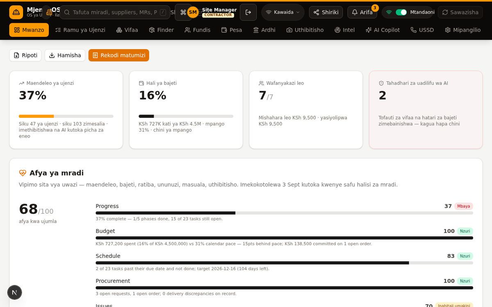

## Deployment

Docker quick start:

```bash
cp .env.example .env        # set NEXTAUTH_SECRET (openssl rand -hex 32)
docker compose up -d --build  # → http://localhost:3000 (migrations run on boot)
```

The image is two Debian stages (bun builder → `node:20-slim` runner,
non-root, `prisma migrate deploy` on boot). Full guide — env vars, seed
chain, self-host without Docker, reverse proxy (the PR #7 lessons in nginx
form), health monitoring, SQLite backups, secrets handling — in
[DEPLOYMENT.md](./DEPLOYMENT.md). Health probe: `GET /api/health`.

## CI/CD

`.github/workflows/ci.yml` runs lint + strict typecheck + a real
`next build` on every push/PR; `docker.yml` builds the Docker image on a
GitHub runner (the dev sandbox has no docker CLI — CI is the verification).
The unit suite — **1,100+ tests across 43 vitest files** (`bun run test`) —
is the local gate; every wave merge re-ran it in full (495 → 899 → 1,019 →
1,102 tests across the release waves). PR runs auto-cancel on new commits. Workflows are currently paused by a
billing lock on the account — they exist, are green on the last runs, and
resume unchanged when billing is restored.

## Honesty notes (deliberate)

- Payment rails default to **simulated** (labeled in the UI): the ledger,
  approval workflow, idempotency and reversal mechanics are real. A M-Pesa
  Daraja **sandbox** provider ships behind the `PaymentProvider` seam and
  activates only when its env credentials are set — no licensed rail is
  claimed, and no real money moves.
- Notifications are in-app by default; SMS is optional and comes in two
  honest flavors behind the same provider seam — a generic webhook
  (`NOTIFY_SMS_WEBHOOK_URL`, credentials stay in your gateway) or a direct
  Africa's Talking provider (`AT_API_KEY` + `AT_USERNAME`, the API key
  lives in app env — the documented tradeoff). Either way rows honestly
  record `sent`/`failed` + delivery detail — nothing pretends to have
  sent when no provider is configured.
- Land verification records evidence; it never claims government
  confirmation. Supplier verification is a platform ladder, never conflated
  with state licensing.
- USSD is a faithful simulation of the `*384#` flow that dispatches real
  attendance records; no telco gateway is wired yet.
- The WhatsApp field line is the same honest pattern: a documented webhook
  contract, a keyword grammar and a simulator, with real attendance and
  photo-comment rows written through the app's own appliers — but no Meta
  Cloud API is wired; every reply is footered "MjengoOS sim".
- AI results are labeled with confidence and require human application —
  AI never writes official records directly.

## Project structure & docs

| Path | What |
|---|---|
| `src/app/` | App Router: one page (`page.tsx`) + `/api/**` (auth, projects, actions, sync, share, upload, search, flags, notifications, jobs/run, audit, reports, health, ussd, whatsapp, 5 AI routes) + the `/api/v1` REST surface (19 OpenAPI-documented paths) + `/api/openapi.json` |
| `src/frontend/` | Web UI: `mjengo/` tab surfaces, `ui/` shadcn primitives, `auth/`, `i18n/`, `hooks/` (use-mjengo payload facade + offline outbox) |
| `src/backend/` | Server-only: `lib/` (guard, auth, audit, rate-limit, db, ai, mjengo dispatcher), `actions/`, `modules/` per domain |
| `src/mobile/` | Phone-first bottom nav |
| `src/shared/` | Isomorphic contracts: `permissions.ts` role matrix, `client-actions.ts` allowlist |
| `mjengoos-website/` | Marketing site (independent Next.js app, `:3001`, proxied at `/website`) |
| `prisma/` | `schema.prisma` (63 models), `migrations/` (0_init + additive 1_mjengo_score, 2_draw_pack), `seed.ts` + `seed-extras/` |
| `public/` | PWA manifest + service worker, demo site photos, Swahili voice notes |
| [ARCHITECTURE.md](./ARCHITECTURE.md) | Module map + production migration roadmap |
| [DEPLOYMENT.md](./DEPLOYMENT.md) | Build/run/test/deploy operations guide |
| [docs/RELEASE-NOTES.md](./docs/RELEASE-NOTES.md) | Plain-language release notes — v0.1 → v0.2.x, wave by wave |
| [docs/backlog.md](./docs/backlog.md) | PM release plan (waves 3–5) with paste-ready issue texts |
| [SECURITY.md](./SECURITY.md) | Vulnerability reporting policy |

Roadmap lives in [GitHub issues](https://github.com/Roy-Wanyoike/Mjengo-OS/issues).

## License

[MIT](./LICENSE) — Copyright (c) 2026 Roy Wanyoike.
